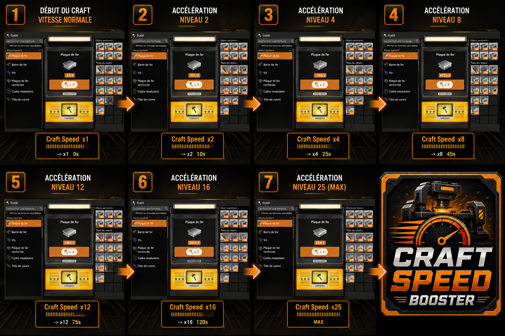

# Craft Speed Booster

A lightweight mod for Satisfactory that progressively increases manual crafting speed the longer you craft continuously — without breaking game balance.


## How it works

The longer you hold the craft button without stopping, the faster your workbench produces items. Stop crafting for more than 1.5 seconds and the streak resets.

| Time crafting | Speed multiplier |
|---------------|-----------------|
| 0s            | x1 (normal)     |
| 10s           | x2              |
| 25s           | x4              |
| 45s           | x8              |
| 75s           | x12             |
| 120s          | x16             |
| 180s          | x20             |
| 300s          | x25             |

## HUD

A non-intrusive overlay appears at the bottom-center of the screen while crafting, showing:
- Current speed multiplier
- Progress bar toward the next tier `[||||||||........]`
- Time remaining until next tier

The HUD disappears automatically when you stop crafting.

## Configuration

On first launch, a config file is generated at:
```
<Satisfactory>/Mods/GameFeatures/ManualCraftingAcceleratorLight/Config/ManualCraftingAcceleratorLight.ini
```

Edit it with any text editor and restart the game to apply changes.

```ini
[Settings]
InactivityDelay=1.5   ; seconds before streak resets
WidgetScale=1.0       ; HUD size (0.5 = small, 2.0 = large)

[Tiers]
; Format: Tier_N=Time(s),Multiplier
Tier_0=0,1
Tier_1=10,2
Tier_2=25,4
; ... add or remove tiers freely
```

## Multiplayer

Each workbench tracks its own streak independently. One player stopping does not reset another player's streak.

## Compatibility

- Satisfactory 1.2.x (CL#491125+)
- SML 3.12.0+

## Acknowledgements

Inspired by [FasterManualCraftingRedux](https://ficsit.app/mod/FasterManualCraftingRedux) by its original author. This mod was rebuilt from scratch for Satisfactory 1.2 compatibility, with additional features and a different technical approach.

## License

MIT — see [LICENSE](LICENSE)
